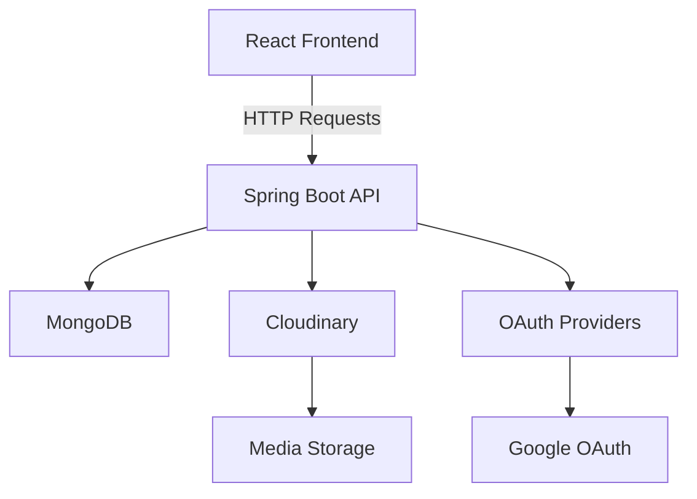

# 🌟 SkillSphere – Skill-Sharing & Learning Platform

**SkillSphere** is a modern full-stack web platform that enables users to **share skills**, **track learning progress**, and **connect with a global community**. It combines **social networking features** with **structured learning tools** to make skill development engaging and collaborative.

Built with **Spring Boot REST API** (backend) and **React** (frontend), the platform supports real-time communication, cloud-based media storage, and responsive design for an optimal experience on all devices.

---

## 📌 Table of Contents

* [🚀 Key Features](#-key-features)
* [🛠 Technology Stack](#-technology-stack)
* [🏗 System Architecture](#-system-architecture)
* [⚙ Installation Guide](#-installation-guide)
* [👥 Contributors](#-contributors)

---

## 🚀 Key Features

### 🔹 Core Functionality

* **Skill Sharing Posts** with media uploads (up to 3 images/videos per post)
* **Learning Progress Tracking** with customizable templates and visual milestones
* **Structured Learning Plans** with resources and timelines
* **User Engagement** via likes, comments, and follows
* **Social Features** including personalized feeds and chat
* **Secure Authentication** with email/password & **OAuth 2.0** (Google login)

---

### 🔹 Specialized Components

#### **1. User Management** *([Buwaneka99](https://github.com/Buwaneka99)*)

* Secure **email/password authentication**
* **Google OAuth 2.0 integration** for quick login
* User profiles with skills, location, and contact details
* **Follow/unfollow** system for user connections
* **Role-based access control** (User/Admin)

#### **2. Progress Tracking** *([Buwaneka99](https://github.com/Buwaneka99))*

* Customizable templates for various skill types
* Visual timeline of **learning milestones**
* Achievement badges for completed goals
* Likes and comments on progress updates
* Integration with skill posts for practical application

#### **3. Learning Plans** *([Buwaneka99](https://github.com/Buwaneka99))

* Create structured plans with topics, resources, and deadlines
* Visual progress indicators for completion tracking
* Option to share learning plans with the community

#### **4. Social Features** *([Buwaneka99](https://github.com/Buwaneka99))*

* Personalized feed showing posts from followed users
* Real-time **chat system** between users
* Notifications for likes, comments, and follows
* User search and discovery tools
* Follow list management

#### **5. Admin Dashboard** *([Buwaneka99](https://github.com/Buwaneka99))*

* User management tools for admins
* Content moderation panel
* Analytics and statistics visualization
* Progress management system
* Monetization request handling

#### **6. Technical Highlights** *([Buwaneka99](https://github.com/Buwaneka99))*

* Fully responsive design for mobile and desktop
* Secure authentication & authorization layers
* Real-time notifications and chat with WebSockets
* Cloud-based media storage using **Cloudinary**
* Modern UI with animations & smooth transitions
* Data validation and error handling

#### **7. Skill Sharing Posts Management** *([KalpaVidusha](https://github.com/KalpaVidusha))*

* Cloudinary media storage integration
* Media validation (3 files max, 30s video limit)
* Post creation, editing, and deletion

#### **8. Like & Comment Management** *([DilmiJ](https://github.com/DilmiJ))*

* Real-time engagement tracking
* Comment editing/deletion permissions
* Like counters with user tracking

#### **9. Monetization & Reward System** *([SanilkaSrimal](https://github.com/SanilkaSrimal))*

* Monetization request workflow
* Reward tracking and approval system
* Earnings dashboard for content creators

---

## 🛠 Technology Stack

**Backend:**

* Spring Boot 3.1
* Spring Security (OAuth 2.0)
* MongoDB
* Cloudinary (Media Storage)
* Swagger/OpenAPI (API Docs)
* JUnit, Mockito, Testcontainers (Testing)

**Frontend:**

* React 18
* Material-UI
* React Router 6
* React Context API (State Management)
* Axios (HTTP Client)
* react-player, react-dropzone (Media Handling)

---

## 🏗 System Architecture



---

## ⚙ Installation Guide

### Prerequisites

* Java 17+
* Node.js 18+
* MongoDB 6.0+
* Cloudinary account (for media storage)

### Backend Setup

```bash
# Clone the repository
git clone https://github.com/yourusername/skillshare-platform.git
cd skillshare-platform/backend

# Configure application.properties
spring.data.mongodb.uri=mongodb://localhost:27017/skillshare
cloudinary.cloud-name=your_cloud_name
cloudinary.api-key=your_api_key
cloudinary.api-secret=your_api_secret

# Run backend
./mvnw spring-boot:run
```

### Frontend Setup

```bash
cd ../frontend
npm install
npm start
```

---

## 👥 Contributors

|                                 👨‍💻 Developer        | 🎯 Focus Area    | 🌟 Contribution                                                                     |
|-----------------------------------------------------|-------------------|--------------------------------------------------------------------------------------|
| **[Buwaneka99](https://github.com/Buwaneka99)**     | Full-Stack Lead   | User Management, Progress Tracking, Learning Plans, Social Features, Admin Dashboard |
| **[KalpaVidusha](https://github.com/KalpaVidusha)** | Media Specialist  | Skill Sharing Posts, Cloudinary Integration                                          |
| **[DilmiJ](https://github.com/DilmiJ)**             | Engagement Expert | Like & Comment System, User Interactions                                             |
| **[SanilkaSrimal](https://github.com/SanilkaSrimal)** | Business Logic  | Monetization System, Reward Management                                               |

---
