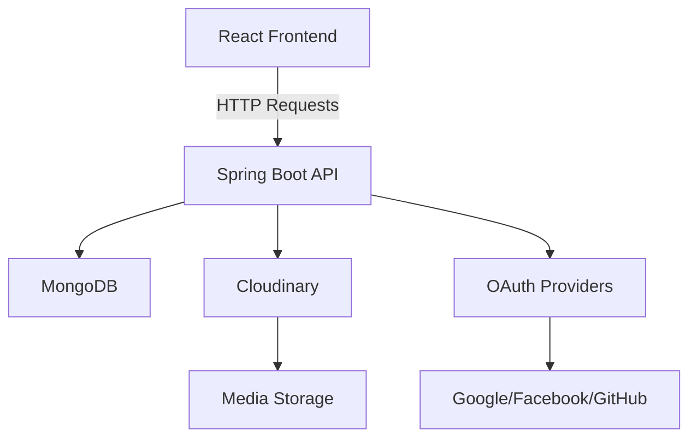

# SkillSphere - Skill-Sharing & Learning Platform

 <!-- Replace with actual screenshot -->

SkillShare is a modern web platform that enables users to share skills, track learning progress, and engage with a community of learners. This project implements a full-stack solution with a Spring Boot REST API and React frontend.

## Table of Contents
- [Key Features](#key-features)
- [Technology Stack](#technology-stack)
- [System Architecture](#system-architecture)
- [Installation Guide](#installation-guide)
- [Contributors](#contributors)


## Key Features

### Core Functionality
- **Skill Sharing Posts** with media uploads (3 images/videos per post)
- **Learning Progress Tracking** with customizable templates
- **Structured Learning Plans** with resource management
- **User Engagement** through likes and comments
- **Social Features** including user profiles and follow system
- **OAuth 2.0 Authentication** via social media accounts

### Specialized Components
1. **Skill Sharing Posts Management** ([KalpaVidusha](https://github.com/KalpaVidusha))
   - Cloudinary media storage integration
   - Media validation (3 files max, 30s videos)
   - Post creation/editing/deletion

2. **Like & Comment Management** ([DilmiJ](https://github.com/DilmiJ) )
   - Real-time engagement tracking
   - Comment editing/deletion permissions
   - Like counters with user tracking

3. **Monetization & Reward System** ([SanilkaSrimal](https://github.com/SanilkaSrimal) )
   - Monetization request workflow
   - Reward tracking and approval system
   - Earnings dashboard for creators
  
 4. **Learning Progress Tracking** ([Buwaneka99](https://github.com/Buwaneka99) )
   - Predefined progress templates for consistent updates
   - Visual timeline of learning milestones
   - Achievement badges for completed goals
   - Integration with skill posts for practical application

## Technology Stack

### Backend
- **Framework**: Spring Boot 3.1
- **Security**: Spring Security with OAuth 2.0
- **Database**: MongoDB
- **Media Storage**: Cloudinary
- **API Documentation**: Swagger/OpenAPI
- **Testing**: JUnit, Mockito, Testcontainers

### Frontend
- **Framework**: React 18
- **State Management**: React Context API
- **Routing**: React Router 6
- **UI Library**: Material-UI
- **HTTP Client**: Axios
- **Media Handling**: react-player, react-dropzone


## System Architecture



## Installation Guide

### Prerequisites
- Java 17+
- Node.js 18+
- MongoDB 6.0+
- Cloudinary account (for media storage)

### Backend Setup
1. Clone the repository:
   ```bash
   git clone https://github.com/yourusername/skillshare-platform.git
   cd skillshare-platform/backend
   ```

2. Configure application properties:
   ```properties
   # src/main/resources/application.properties
   spring.data.mongodb.uri=mongodb://localhost:27017/skillshare
   cloudinary.cloud-name=your_cloud_name
   cloudinary.api-key=your_api_key
   cloudinary.api-secret=your_api_secret
   ```

3. Run the application:
   ```bash
   ./mvnw spring-boot:run
   ```

### Frontend Setup
1. Navigate to frontend directory:
   ```bash
   cd ../frontend
   ```

2. Install dependencies:
   ```bash
   npm install
   ```

3. Start development server:
   ```bash
   npm start
   ```

<!--## API Documentation

Access interactive API documentation at `http://localhost:8080/swagger-ui.html` after starting the backend:

-->

Key API Endpoints:
- `POST /api/posts` - Create new skill share post
- `GET /api/posts` - Get paginated posts
- `PUT /api/comments/{commentId}` - Update comment
- `POST /api/monetization` - Submit monetization request
- `GET /api/users/me` - Get current user profile

## Contributors

| Component                  | Developer              | 
|----------------------------|------------------------|
| Skill Sharing Posts        | [KalpaVidusha](https://github.com/KalpaVidusha)            | 
| progress tracking          |[Buwaneka99](https://github.com/Buwaneka99)     | 
| Like & Comment Management  | [DilmiJ](https://github.com/DilmiJ)        |
| Monetization & Rewards     | [SanilkaSrimal](https://github.com/SanilkaSrimal)     | 

